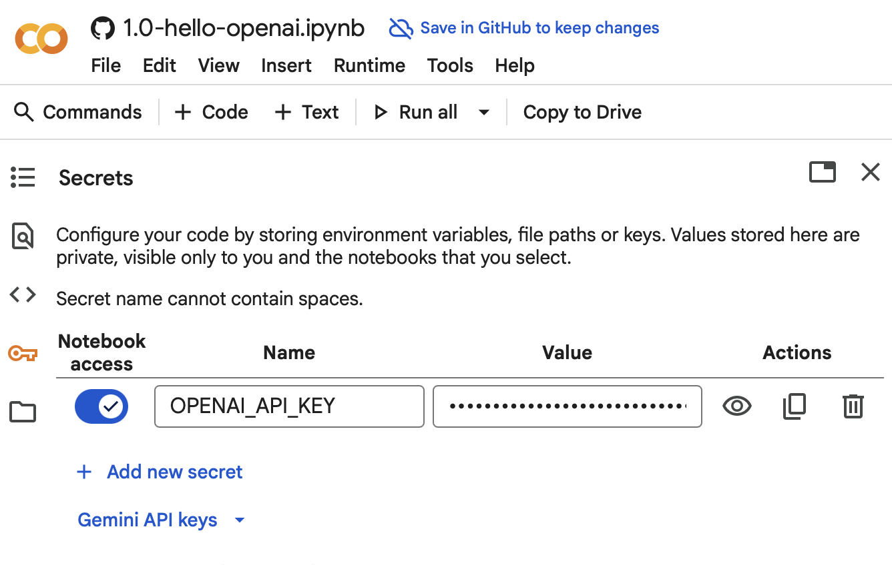
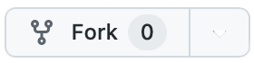

# Välkommen till # AI-Agenter 2025!

## Let's Build!

* **Steg 1**: Börja med att formulera din grundidé 
- Skapa ett nytt repository
- Skapa en readme med en grov beskrivning att applikationen
    - Tips: Be om hjälp med att förfina en initial idé Eller: använd kommandot  /process:1-idea-refinement

* **Steg 2**: Kopiera filer från ai-agenter-2025, förslagsvis: 
 - `.devcontainer/devcontainer.json`
 - `setup-devcontainer.sh`
 - För en lista med redan på förhand godkända operationer (kolla gärna igenom först) - kopiera `.claude/settings.local-example.json` och byt namn till `.claude/settings.local.json`
 - Övriga potentiellt intressanta filer:
    - Guidelines under `ai_docs/guidelines`
    - En "mall" för CLAUDE.md: [ai_docs/templates/CLAUDE_md_temlplate.md](ai_docs/templates/CLAUDE_md_temlplate.md)
    - En uppsättning sub-agenter: `.claude/agents`
    - En uppsättning custom slash commands: `.claude/commands`

* **Steg 3**: Välj ditt flöde
- Spec-kit eller mer “fritt” flöde - you decide
   

## Sätt upp din utvecklingsmiljö

### Hemligheter / Secrets
...finns [här](https://docs.google.com/document/d/1GU-AHlKJ1WrakcmzZdqxsi9HrmI2nJY15bt23B0TWC0/edit?usp=drive_link) för inklistring på läpligt ställe (`.env`-fil etc)`. 


## Länkar
- [AGENTIC-CODING-TIPS.md](AGENTIC-CODING-TIPS.md)
- [GitHub Spec kit](https://github.com/github/spec-kit)
- [Claude Code docs](https://docs.claude.com/en/docs/claude-code/overview)
- [Claude Code: Best practices for agentic coding](https://www.anthropic.com/engineering/claude-code-best-practices)


## Google Colab - For Jupyter Notebooks Exercises

1. **Use Google Colab (requires a Google account)**:
    - Click the corresponding _**`Open in Google Colab`**_ link below.
    - Configure "Secrets" / API-keys (reachable from the left-hand menu).
      


## Local (or Cloud) Development Environment Setup

### 1. Use a Dev Container (requires Docker or similar installed locally)
1. Install [Docker](https://www.docker.com/get-started/) (or similar container runtime).
2. Open this folder in VSCode.
3. Install the [Dev Containers](https://marketplace.visualstudio.com/items?itemName=ms-vscode-remote.remote-containers) extension if you haven't already.
3. When prompted, click "Reopen in Container".
4. Create a `.env` file with your API keys.


### 2. Local environment setup (if you have Python installed locally)

1. Install dependencies:
```bash
# Install uv (https://docs.astral.sh/uv/)

# Run uv sync to install dependencies
uv sync
```

2. Create a `.env` file with your API keys:
```
OPENAI_API_KEY=your_key_here
ANTHROPIC_API_KEY=your_key_here
```

3. Run exercises or scripts:
```bash
uv run jupyter notebook some-notebook.ipynb  # For lab exercises
uv run script.py         # For Python scripts
```

### 3. **Use GitHub Codespaces - (requires a GitHub-account)**:
- _(Optional first step if you want to save your changes: **Fork this repo**)_ <br/>
    

- Click "Code" and then "Create codespace on main" in the GitHub UI<br/>
    <br/>
    
    <br/>

- Wait for the codespace to be created and then create a `.env` file with the API-keys.
    (_**See below for screenshots**_)


## Creating a Private Fork (After Cloning)

If you've already cloned this repository and want to convert it to a private fork to save your work:

1. **Update your local repository's remote**:
   ```bash
   # Check your current remote
   git remote -v

   # Add your new private repo as a remote (or rename the existing origin)
   git remote add private https://github.com/YOUR_USERNAME/ai-agenter-2025-private.git

   # OR rename the existing origin to upstream and add your private repo as origin
   git remote rename origin upstream
   git remote add origin https://github.com/YOUR_USERNAME/ai-agenter-2025-private.git
   ```

2. **Push your code to the private repository**:
   ```bash
   # Push all branches and tags to your private repo
   git push -u origin main
   git push origin --all
   git push origin --tags
   ```

3. **Keep your private fork updated** (optional):
   ```bash
   # If you renamed origin to upstream, you can pull updates from the original repo
   git fetch upstream
   git merge upstream/main
   git push origin main
   ```

**Note**: GitHub doesn't allow traditional forking of public repositories into private ones. This method creates an independent private repository with the same history.


## Jupyter Notebooks in GitHub Codespaces
There is a bug in the latest Microsoft Jupyter extension that prevents Jupyter Notebooks from working properly in Codespaces. To work around this, **revert it back to version 2025.8.x**

## Jupyter Notebooks Colab links

Open notebook here on GitHub and then click the "Open in Colab" button (like the one below).<br/>


